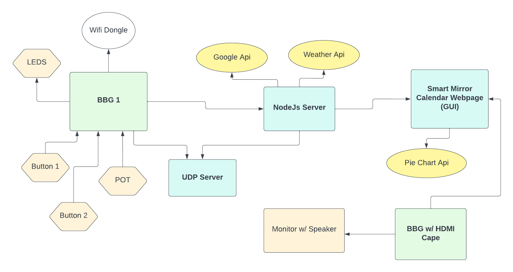
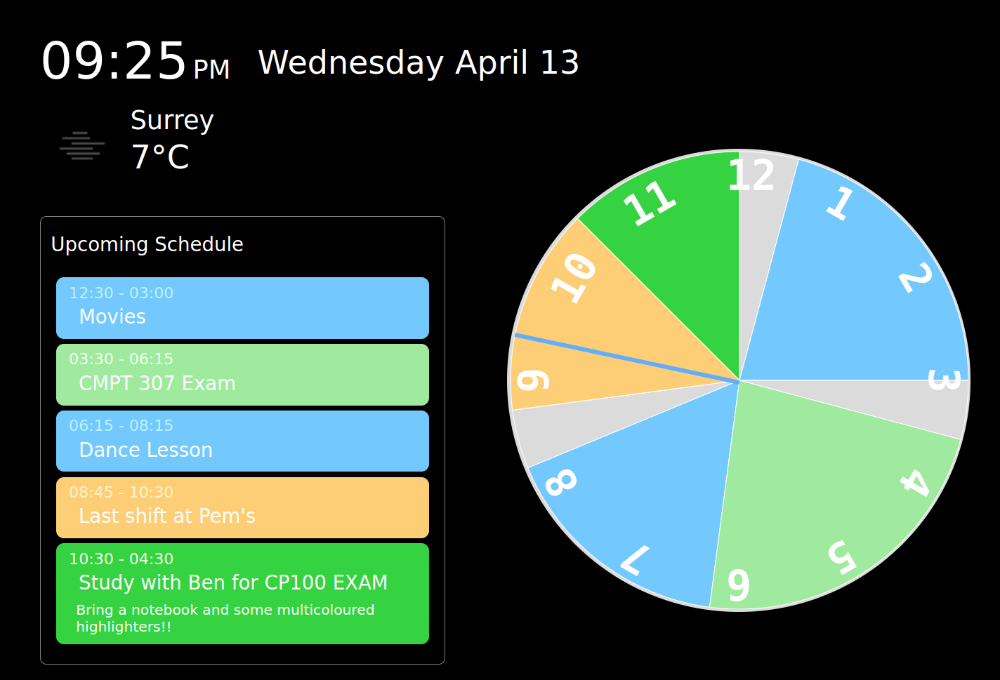
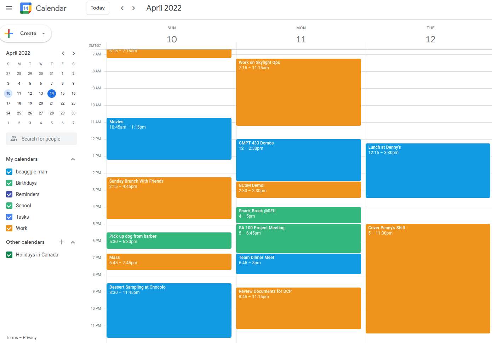
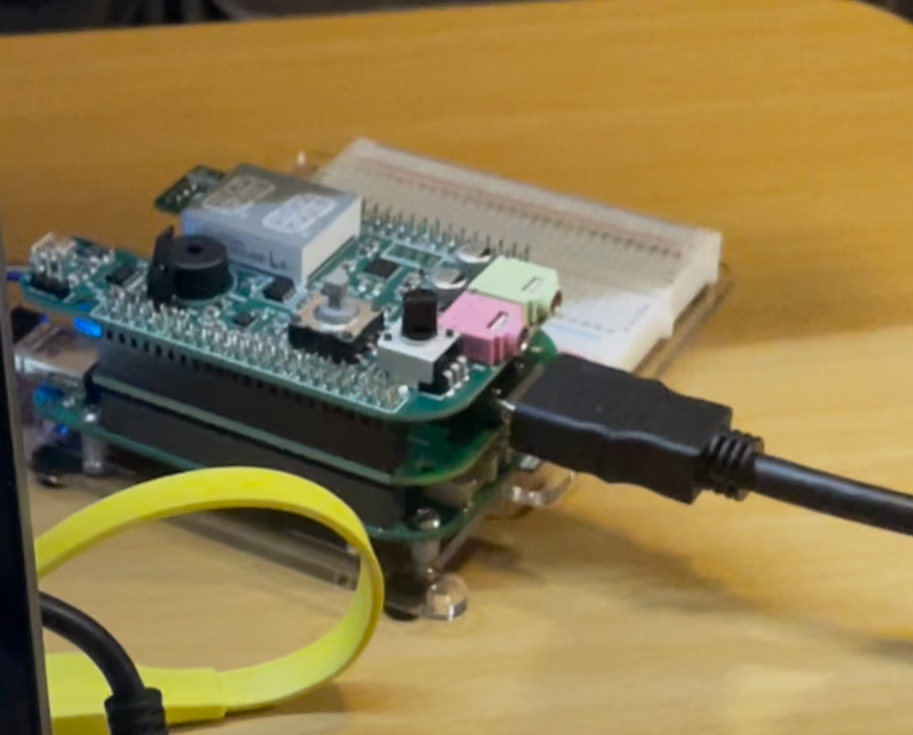
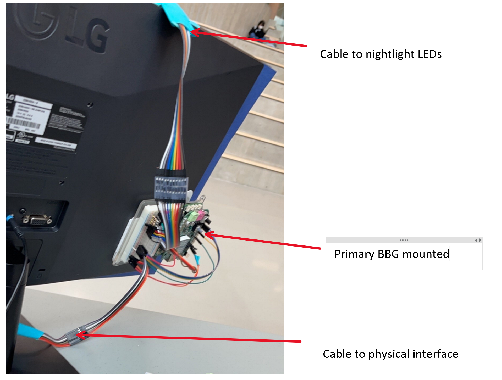
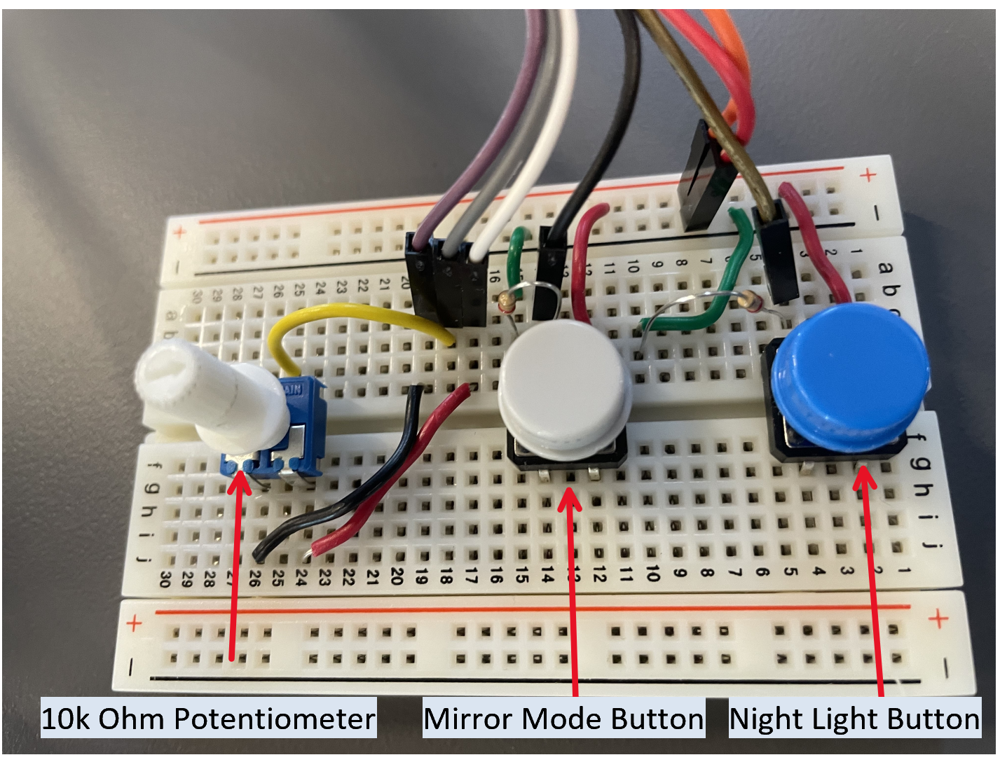
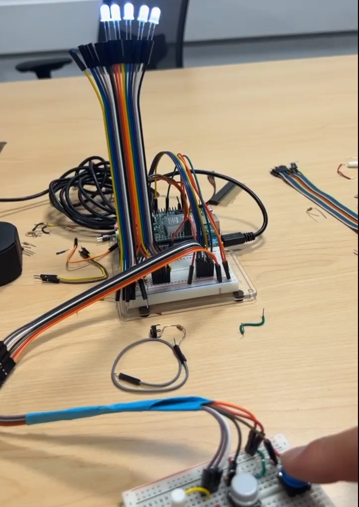
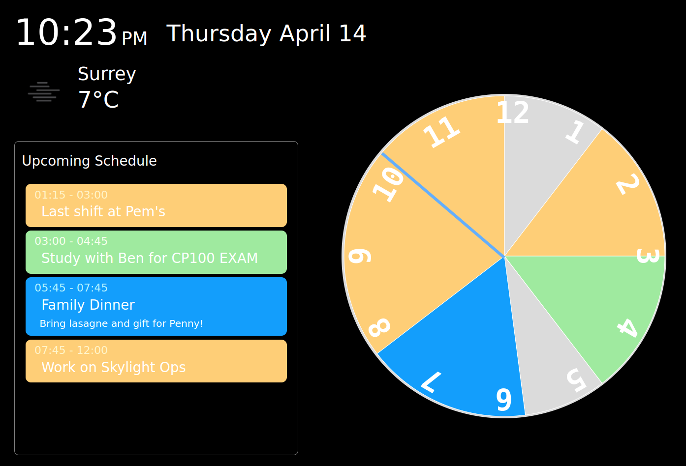
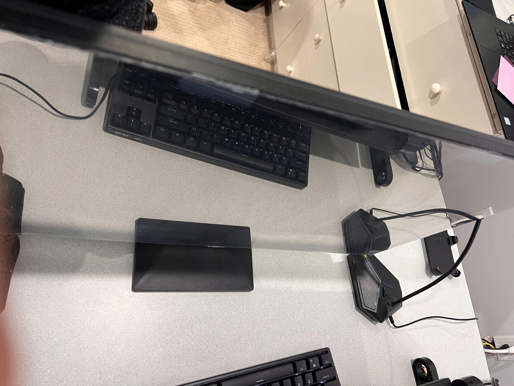

# Embedded Systems Project

# Google Calendar Smart Mirror

Project Report

04.13.2022

**─**

# System Explanation

## Overview

Google Calendar Smart Mirror presents events from Google Calendar and maps them to a pie chart representing an analog clock, as a visual representation of one's schedule. The mirror also provides a weather forecast and the local date and time. An HDMI cape is used to interface with a monitor (that is behind the mirror), and wifi is added to communicate with Google Calendar and Weather APIs.

## BBG Client

On the client-side, requests to the Google Calender API server are made for calendar events from each available calendar, specifying a time range based on the user's local time. Requests for the weather API and user inputs from the Beaglebone are also made. Because each calendar requires a separate call to Google’s API, the client waits to collect all calendar events to sort the events in time order. The client then uses the data to make an API call to Google Charts to dynamically generate a pie chart with each event represented as a slice on the pie. We use jQuery to also dynamically generate the ‘Upcoming Schedule’ list on the left, presenting each event’s type, represented by colour, its title, time and its description, which is hidden until the user selects it for more details.

## BBG Server

On the server-side, requests with relevant client data are made to the Google Calendar API and openweathermap.org and returned to the client. One of the Beaglebones listens on the UDP server for any commands sent from the client web server. When the hardware is being used, the client web server and application relay commands between each other, such as the pot readings when the user turns the potentiometer to change the selected event on the website.

*Speaker mounted and connected to monitor          HDMI connected to HDMI cape*

*Primary BBG + mounted*

## Hardware Features

On the hardware side of the project, we have two Beaglebones, one attached with the HDMI cape and is connected to the monitor, and the other one host the web application server and UDP server. This allows us to use the former to display the webpage via a monitor with our reflective film to emulate a tabletop mirror. Our server Beaglebone has added hardware components to interact with the web page.

*Physical interaction interface*

### Night Light

LEDs and a button connected to the Beaglebone provide a night light feature. The buttons allow LEDs above the monitor to cycle through modes, which correspond to the number of LEDs that light up. 

*The night light after 1, 2, and 4 clicks.*

### Event Selection

The potentiometer can scroll through the events and select an event to display more information. When an event is selected, its details from the calendar are revealed and its corresponding slot on the chart clock is highlighted.

*1: an event selected via POT, 2: another event selected*

### Mirror Modes

Another button connected to the Beaglebone hides elements on the screen for use as a mirror when pressed. This allows the monitor with the reflective film to use the entire screen as a mirror. Another press activates a ‘ring light’ around the border of the screen to emulate a backlit mirror.

*Mirror. How do you take a picture of a mirror?*

### Other Planned Features

Watchdog and systemd are features we would have liked to integrate, if we had time to continue working on the project. Our plan was to run the client web application on the BBG on bootup. We ultimately prioritize our time with fleshing out critical features.  Another feature we tried to integrate was to change the brightness of the screen given the voltage readings from the light sensor. We had this code figured out and had figured out how to write brightness to linux, but we were unable to run things on our BBG with the HDMI cape due to the limitations of the Linux Kernel version.

## Additional Hardware and Software Used

### Hardware

We figured out what kind of potentiometer the zenscape uses (a 10k ohm potentiometer) so that we could remove the physical interface from the beaglebone.

We used a now unsupported BeagleBone Cape, the HDMI Cape as a part of our project. This involved learning what was and was not compatible with [Debian 8.10 2018-02-01 4GB SD SeeedStudio IoT](https://debian.beagleboard.org/images/bone-debian-8.10-seeed-iot-armhf-2018-02-01-4gb.img.xz) image from beaglebone.org. We learned after 10 hours of troubleshooting it was not possible to update the node.js version (we were trying to run the node server on the hdmi cape to share the load), and that we are unable to update the gcc version from 4.9. We remedied the issue by using another beaglebone as a host and serving the application locally. We also learned how to make more space on the bbg by deleting the usr/share/locale folder (100-150 mb).

### Software

We used Googles Calendar and Chart APIs as well as a weather API from openweathermap.org

### All hardware used:

Monitor: We used a Monitor to be the display for our smart mirror.

Sheet of Clear Acrylic: After much experimentation and research, we used a sheet of clear acrylic as the base for the mirror part of our smart mirror.

Reflective film: We used reflective one way mirror film to turn our acrylic sheet into a one way mirror.

HDMI Cape: We used the the HDMI cape [https://wiki.seeedstudio.com/BeagleBone_Green_HDMI_Cape/](https://wiki.seeedstudio.com/BeagleBone_Green_HDMI_Cape/) to output the display for our GUI

External speaker: We used a speaker connected via 3.5mm audio jack to our monitor (audio played via the hdmi connection, through the browser)

Potentiometer: We used a potentiometer and wired it to a free A2D pin so that we could have a potentiometer as a part of our physical interaction interface.

Buttons: 1 button used to control night light, 1 button used to control monitor view.

Wifi Dongle: Connecting the BBG to a wifi network with the use of ConnMan.

# Feature Table

*(1-2 pages) Table of important product features*

<table>
  <tr>
   <td>
<h2>Description</h2>

   </td>
   <td>Host/

Target
   </td>
   <td>Code
   </td>
   <td>Notes
   </td>
  </tr>
  <tr>
   <td><strong>Event List</strong>
   </td>
   <td>T
   </td>
   <td>JS + CSS
   </td>
   <td>Generates upon receiving all events from server. Highlight and show details of events when selected via POT.
   </td>
  </tr>
  <tr>
   <td><strong>Clock</strong>
   </td>
   <td>T
   </td>
   <td>JS + CSS
   </td>
   <td>Dynamically generated based on chart size with #’s. Hour hand placement with css + js with guide (*).
   </td>
  </tr>
  <tr>
   <td><strong>Google Charts</strong>
   </td>
   <td>T
   </td>
   <td>JS
   </td>
   <td>Send data after converting each hour on the clock as a 1/12 fraction of the pie, adding transparent slices where there are no events.

Update colour of slice(s) upon bbg POT command and redraw pie with new selections.
   </td>
  </tr>
  <tr>
   <td><strong>Event Alert</strong>
   </td>
   <td>T
   </td>
   <td>JS
   </td>
   <td>Plays alert audio on upcoming events within the hour.
   </td>
  </tr>
  <tr>
   <td><strong>Google Cal/</strong>

<strong>Weather API</strong>
   </td>
   <td>T
   </td>
   <td>JS
   </td>
   <td>Followed steps provided for Calendar API and for Open Weather API and integrated requests from start guides (**) into our node server to communicate info via sockets.
   </td>
  </tr>
  <tr>
   <td><strong>Web + API Server</strong>
   </td>
   <td>T
   </td>
   <td>JS
   </td>
   <td>server.js from as3 base code and calender_server.js to make requests to above listed APIs
   </td>
  </tr>
  <tr>
   <td><strong>UDP Server</strong>
   </td>
   <td>T
   </td>
   <td>JS
   </td>
   <td>N/A
   </td>
  </tr>
  <tr>
   <td><strong>External LEDs</strong>
   </td>
   <td>T
   </td>
   <td>C
   </td>
   <td>Uses an external button to light up individual LEDs upon pressing. 
   </td>
  </tr>
  <tr>
   <td><strong>External Potentiometer </strong>
   </td>
   <td>T
   </td>
   <td>C
   </td>
   <td>Used to select events on the pie chart. Works but there are some timing issues in getting the reading and relaying the data to the node server which makes it a little slow sometimes. 
   </td>
  </tr>
  <tr>
   <td><strong>Display Button</strong>
   </td>
   <td>T
   </td>
   <td>C/JS
   </td>
   <td>Read input from an external button to change views for the screen to toggle it between a normal mirror (screen off) and viewable google calendar.

Works perfectly but has a slight timing issues.
   </td>
  </tr>
  <tr>
   <td><strong>Mirror</strong>
   </td>
   <td>O
   </td>
   <td>N/A
   </td>
   <td>We used a one-way mirror film on a piece of clear acrylic to serve as a mirror. When the monitor is set to blank (display button pressed), the user is able to see themselves more clearly. When the display is showing the GUI, the reflection is obscured with the information displayed.

If using a real (glass) two way mirror (~$250 CAD), there would be less glare, and display brightness would not seem lacking
   </td>
  </tr>
  <tr>
   <td><strong>Brightness sensor</strong>
   </td>
   <td>T
   </td>
   <td>C
   </td>
   <td>We wrote the code for using the light sensor, printing out a reading, and mapping out appropriate voltage values for 0-100% brightness. We researched writing to the Linux file system to adjust brightness. We had to scrap this as we were not able to run our C program or node server on the BBG with the HDMI cape, thus could not use our existing system for the communication of the logic
   </td>
  </tr>
  <tr>
   <td><strong>Wifi</strong>
   </td>
   <td>T
   </td>
   <td>N/A
   </td>
   <td>Used a Wifi Dongle to connect the BBG to a wifi network. Uses ConnMan to allow the user to scan for and connect to nearby wifi networks.
   </td>
  </tr>
</table>

( * ) CSS Clock (Hands)    [https://dev.to/code_mystery/simple-analog-clock-using-html-css-javascript-2c6a](https://dev.to/code_mystery/simple-analog-clock-using-html-css-javascript-2c6a)

(**) Google API Quick Start and Open Weather Guide:  https://opencoursehub.cs.sfu.ca/bfraser/grav-cms/cmpt433/links/files/2019-student-howtos/Open-Weather-API.pdf

[https://developers.google.com/calendar/api/quickstart/nodejs](https://developers.google.com/calendar/api/quickstart/nodejs)

[https://opencoursehub.cs.sfu.ca/bfraser/grav-cms/cmpt433/links/files/2019-student-howtos/Open-Weather-API.pdf](https://opencoursehub.cs.sfu.ca/bfraser/grav-cms/cmpt433/links/files/2019-student-howtos/Open-Weather-API.pdf)
